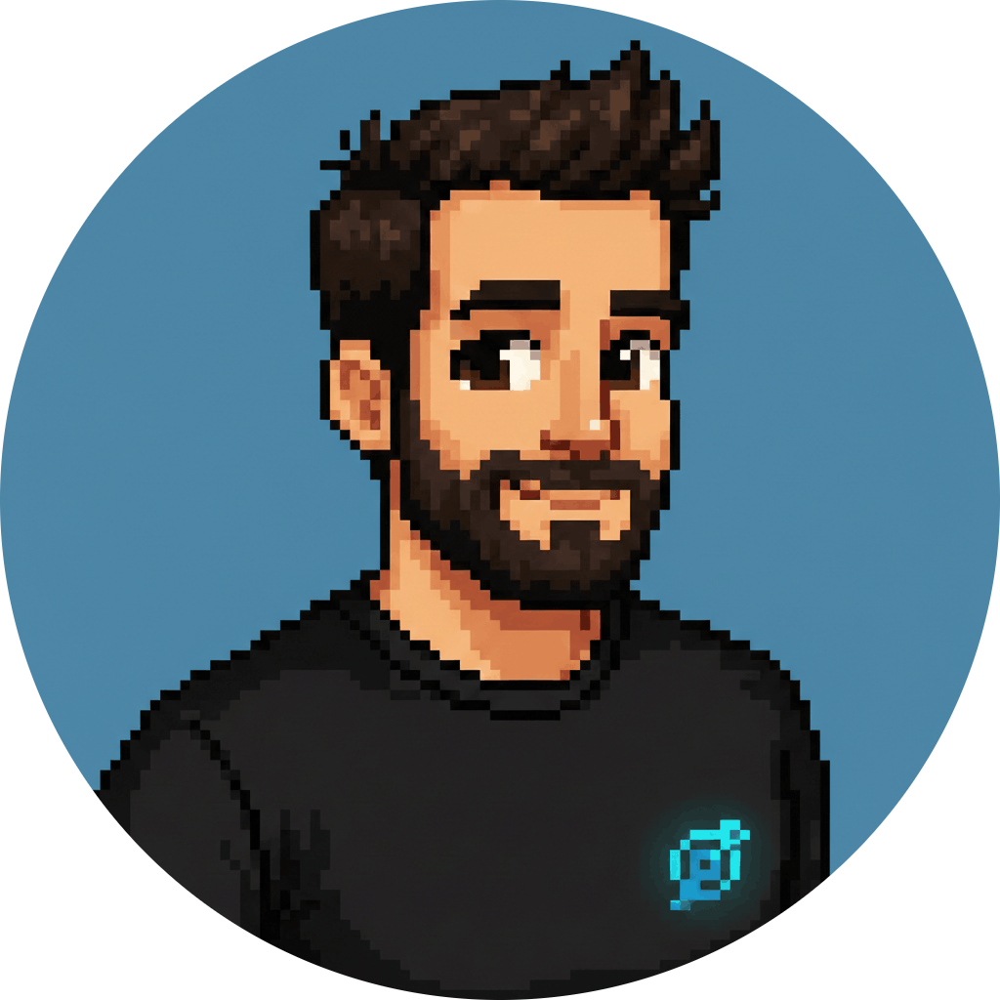

  
  
  # Ichibytes.dev
  
  
The official website of <strong>Ichibytes</strong> aka <strong>Ezequiel Migueles</strong>.

  
  

    
    
    
  

---

## Project

This is the official website of Ichibytes. It is my personal website where I showcase my projects and skills.

It's built using Nx Workspace and the following technologies:

  
<strong>Tech Stack</strong>

  

 

I built this website to showcase my projects and skills. It's a simple website that I'll keep updating as I build more projects and learn new technologies.

I want to help others learn and grow by sharing my knowledge and experiences. I'm a Senior Full-stack Developer and DevOps Engineer and I'm passionate about building scalable and efficient applications and systems.

---

  
Made with ❤️ by <strong>Ezequiel</strong>

  
  
